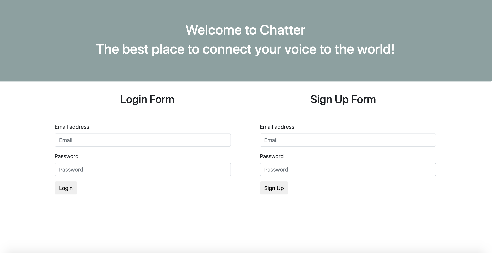
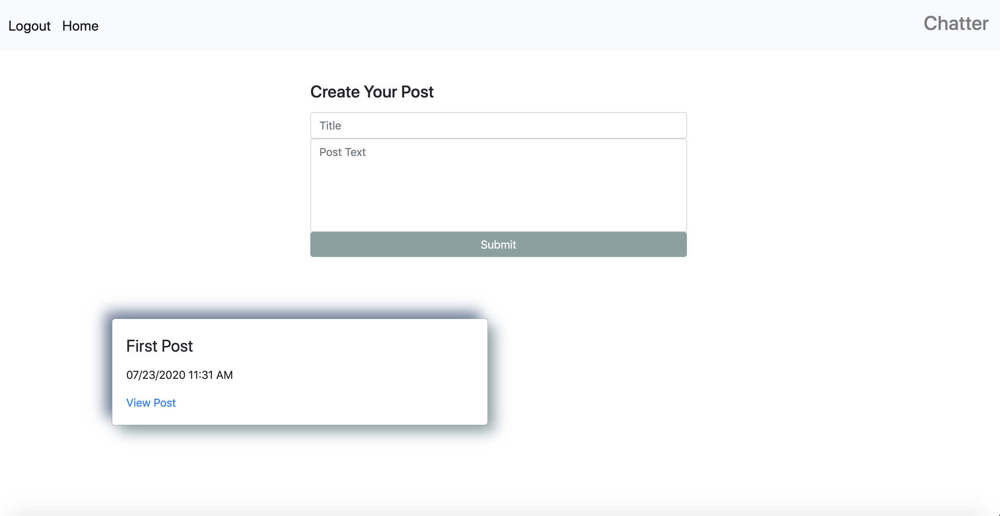
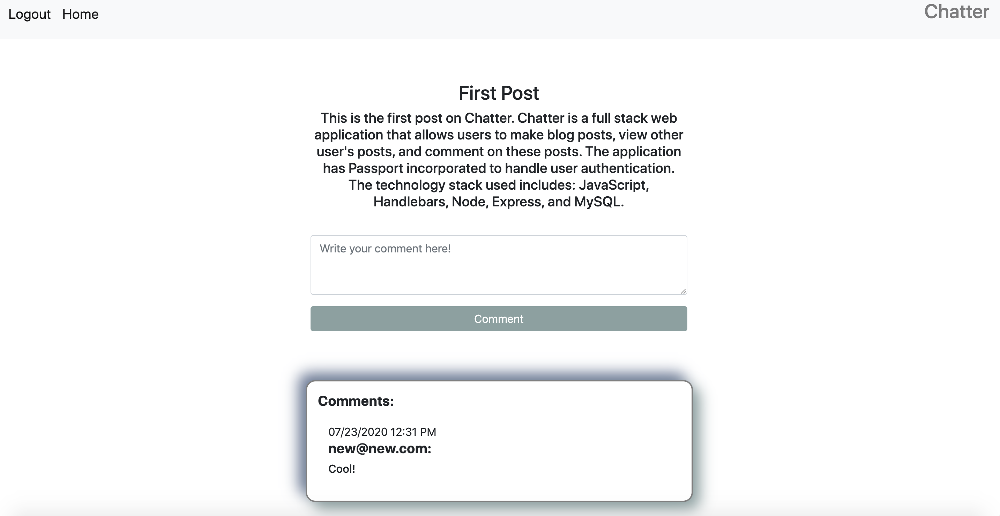

# Chatter

## Description

This application began as a group project during my Full Stack Web Development Boot Camp that I then went back to and refactored and expanded upon the functionality of the application.
The application orginally called Wild Kards was an application that allowed users to enter, and search for quotes from their favorite pseudo celebrities, the Kardashians. I refactored the application to allow users to sign up or login to the application, create blog posts, view all blog posts, and comment on other's posts. 

## Table of Contents
* [Usage](#Usage)
* [Demo](#Demo)
* [Technologies](#Technologies)
* [Deployed-Link](#Deployed-Link)
* [Developer](#Developer)

## Usage

To use this application simply go to the [deployed link](#Deployed-Link)

## Demo

Login View

Posts View

Comments View

## Technologies
* Handlebars
* CSS
* Bootstrap
* JavaScript/jQuery
* Node
* Express
* MySQL

## Deployed-Link

## Developer

Megan Coppins
https://github.com/MeganLCoppins/Chatter